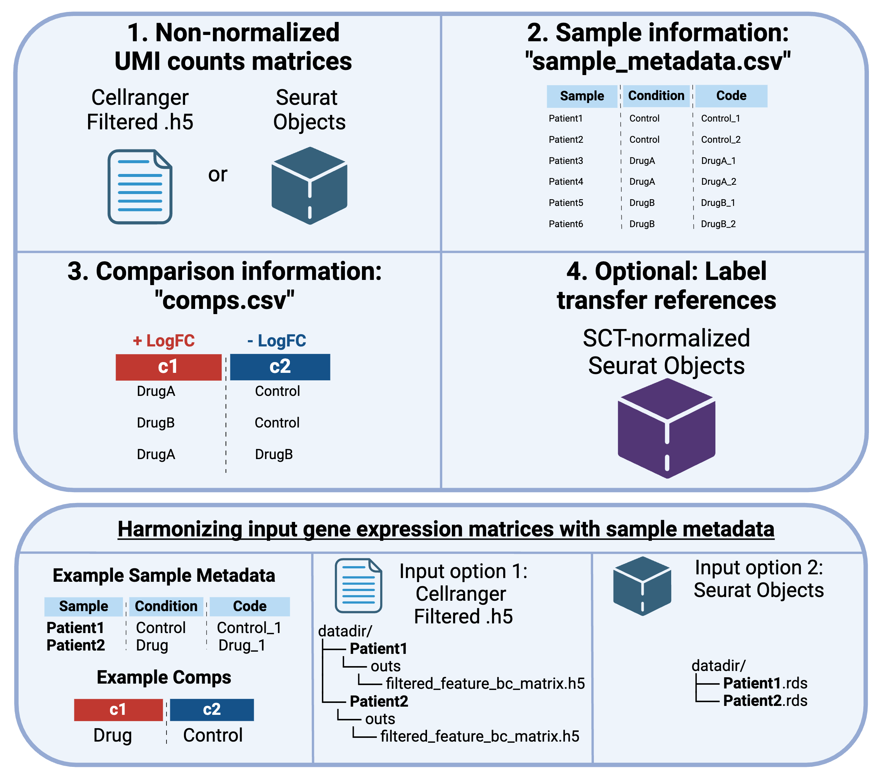
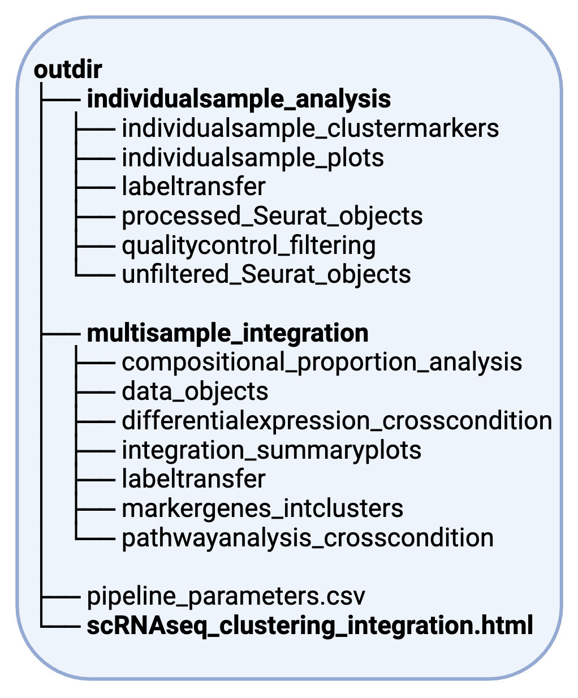

# scDAPP single-cell RNA-seq analysis pipeline usage

This pipeline will perform individual QC and clustering, label transfer from a reference scRNAseq dataset to guess cell types (optional), multi-sample integration via `integration_method` (default `RISC`; Seurat v5 CCA, RPCA, Harmony, and SCT variants also supported — see [Integration assays and reductions](#integration-assays-and-reductions)), and cross-condition compositional (cell proportion) analysis and differential expression (DE) analysis. Multi-condition comparisons (condition A vs B vs C, ie WT vs KO vs Drug) are supported. **v2.0.0** is the current release on the [`dev`](https://github.com/bioinfoDZ/scDAPP/tree/dev) branch; install with `devtools::install_github("bioinfoDZ/scDAPP@dev")` (see [Installation](Installation.md)).

If multiple replicates are present (ie WT 1 and WT2 vs KO1 and KO2), this pipeline can make use of pseudobulk methods for compositional analysis and DE.


<br />

# Usage


If you run into any issues, you can check the [common bugs and fixes FAQ](https://github.com/bioinfoDZ/scDAPP/blob/main/Documentation/CommonBugs.md). If the error is not reported there, please save the error message and open a Github Issue in this repository.


Minimally, this pipeline needs three inputs: the raw UMI counts data in .h5 files or Seurat objects, a file called `sample_metadata.csv` that contains info about the samples, and a file called `comps.csv` that tells the pipeline which cross-condition comparison to perform.





<br />

# Prep the required files

### 1. `datadir`: raw UMI count matrices directly from Cellranger outputs, or a folder of Seurat objects

#### Option 1: Run directly on Cellranger output (ie folders containing .h5 files)

Run Cellranger and keep the output folders from all samples together in a single folder.
The parameter `datadir` is the path to a folder containing the Cellranger outputs.

Cellranger produces many output files for each sample. Minimally, the folders in `datadir` must contain one item, the file called `filtered_feature_bc_matrix.h5`. For example, if you have four samples, you will need (or if you have run Cellranger, already have) a folder with four sub-folders with the sample names. `datadir` should be the path pointing to folder holding everything. It will search the subfolders for the `filtered_feature_bc_matrix.h5` files. The sample names (sample sub-folder names) should match the "Sample" column of the `sample_metadata.csv` file as explained below.


#### Option 2: Inputting Seurat Objects: `input_seurat_obj` = T

Alternatively, the pipeline accepts Seurat objects if `input_seurat_obj` is set to TRUE. This can be useful for hashed/multiplexed samples, pre-filtered samples, or published data for which .h5 files are not easily available.

Save each Seurat object as individual .rds files using the `saveRDS()` R command. Each sample should be named "SampleXYZ1.rds" and so on. The sample names should match the "Sample" column of the `sample_metadata.csv` file as explained below. The pipeline will use the "RNA" assay and the "counts" layer/slot of the Seurat objects.

For [hashed](https://cite-seq.com/cell-hashing/) or [multiplexed](https://www.10xgenomics.com/support/software/cell-ranger/latest/analysis/running-pipelines/cr-3p-multi) inputs, this option can also be used. We recommended splitting all of the samples apart into separate Seurat objects even if they are from the same hash / CMO pool.

Note that as of v1.3.1 (released mid May 2025), you can now pre-compute QC-related metrics like "percent.mito", "percent.hemoglobin" or "Phase" in the input Seurat objects, thus allowing you to pass these to the automated QC steps if using Seurat objects as input. Useful for when running organisms besides human/mouse.

<br />

### 2. `sample_metadata`: sample information

For worked examples of comparative designs (Wilcox, pseudobulk EdgeR/DESeq2, multi-condition, covariates, interactions, and Dream pairing), see [Comparative_Designs.md](Comparative_Designs.md).

The parameter `sample_metadata` is a path to a .csv file that looks like this:


```
Sample,Condition,Code
SampleXYZ1,Control,Control1
SampleXYZ2,Control,Control2
SampleABC1,KO1,KO1_1
SampleABC2,KO1,KO1_2
SampleJKL1,KO2,KO2_1
SampleJKL2,KO2,KO2_1
```

The Sample column here must match the folder names in `datadir` if `input_seurat_obj` is set to FALSE (Cellranger input). For example, `datadir` is a path to a folder with some sub-folders called SampleXYZ1, SampleXYZ2, etc. Or, they must match the names of the Seurat objects if `input_seurat_obj`. If so, `datadir` will instead be a path to a folder containing Seurat objects saved like SampleXYZ1.rds, SampleXYZ2.rds, etc.

The Code column is optional and can be used to give nicknames to samples if the sample names are ugly. If not provided, "Code" will be set to "Sample_Condition", ie SampleXYZ1_Control in the example above.

The order of the samples in this file will determine the plotting order in the report.

You can use the bash/zsh command `nano` to quickly create and save this file as well as the `comps.csv` file if working in a unix shell context.


<br />


### 3. `comps`: tell the pipeline which cross-condition comparisons to perform

Full recipes for each comparison type (including `scRNAseq_pipeline_runner()` calls) are in [Comparative_Designs.md](Comparative_Designs.md).

The parameter `comps` leads to a .csv file that looks like this:

```
c0,c1
Control,KO1
Control,KO2
KO1,KO2
```

Optional columns: `formula` (default `~ Condition`), `contrast`, `label`. Legacy files with `c1,c2` still work (`c2` is renamed to `c0`).

`contrast` grammar depends on `DE_test`: EdgeR / EdgeR-LRT / EdgeR-QLF / Dream use design-coefficient expressions (e.g. `ConditionKO - ConditionControl` or `ConditionA:BatchB`); DESeq2 / DESeq2-LRT use `Factor;num;denom` or `name=ResultsName`. Blank contrast auto-fills for the active style. See [Comparative_Designs.md](Comparative_Designs.md) (includes a short EdgeR-QLF vs EdgeR-LRT pros/cons note).

This is used to tell the pipeline which conditions to compare. Each row sets up a comparison with **c1** (test) vs **c0** (reference). Positive log2FC means higher expression or cell-type proportion in c1.

For batch-adjusted analyses, add covariates to `sample_metadata` and set `formula`, e.g. `~ Condition + Batch` on each row (same formula can be repeated across rows with different c0/c1 pairs).

For **paired** analyses (matched donors / patients across conditions), include an intercept random effect in `formula` and set `DE_test = "Dream"` (requires Bioconductor package `variancePartition`):

```csv
c0,c1,formula,label
Control,Treatment,~ Condition + (1|Patient),Treatment_vs_Control_paired
```

`sample_metadata` must include the block column (here `Patient`). Compositional analysis automatically uses blocked Propeller (`duplicateCorrelation` + `lmFit`) when the formula contains `(1|Patient)`. EdgeR/DESeq2 cannot parse `(1|var)`; use Dream for paired pseudobulk DE.


<br />
<br />


## Upgrading from v1.3

If you used scDAPP v1.3.x, review these **v2.0** changes before re-running or updating downstream scripts. See also the [Changelog](Changelog.md).

### `comps.csv`

- Columns are **`c0`** (reference) and **`c1`** (test). Positive log2FC means higher expression or proportion in c1.
- Legacy files with `c1,c2` still work: `c2` is renamed to `c0`.
- Optional columns: `formula` (default `~ Condition`), `contrast`, `label` for covariate-aware pseudobulk DE and propeller compositional tests.
- Paired designs: use `formula` with `(1|Patient)` (or similar) and `DE_test = "Dream"`; propeller uses the same random-effect term for blocked testing.
- Use `normalize_comps()` when loading or building comparison tables programmatically.

### `Integrated_RISC` assay (RISC integration)

- Batch-corrected expression is stored in Seurat assay **`Integrated_RISC`** (formerly `"RISC"`).
- Set `DefaultAssay(sobj) <- "Integrated_RISC"` for plotting and Wilcox DE on RISC-integrated objects.
- Downstream tools (e.g. ShinyCell) should use `gex.assay = 'Integrated_RISC'` instead of `'RISC'`.

### MSigDB pathway cache

- Prepared pathway tables are cached on disk (user/XDG/R cache, or `{outdir}/msigdbr_cache` fallback), **not** in `multisample_integration/pathwayanalysis_crosscondition/msigdb_pathways.rds`.
- For re-analysis, call `preppathways_pathwayanalysis_crosscondition_module()` or inspect paths with `resolve_msigdbr_cache_dir()` / `msigdbr_cache_path()`. See [MSigDB pathway cache](#msigdb-pathway-cache) below.

### `cluster_unfiltered`

- Default is **`FALSE`**. Pre-filter SCT+Louvain clustering and `Unfiltered-SeuratObject-*.rds` outputs run only when `cluster_unfiltered = TRUE`. The `individualsample_analysis/unfiltered_Seurat_objects/` folder is created only in that case.

### Module return types (programmatic use)

Cross-condition modules now return **flat tables** instead of deeply nested lists:

| Module | Return field | Subset helper |
|--------|--------------|---------------|
| `de_across_conditions_module()` | `de_results` | `de_results_by_cluster()` |
| `compositional_analysis_module()` | `composition_results` | `composition_results_by_comparison()` |
| `pathwayanalysis_crosscondition_module()` | `pathway_results` | `pathway_results_by_cluster()` |
| `ORA_crosscondition_module()` | `ora_results` | `ora_results_by_cluster()` |

The [subclustering vignette](downstream_postpipeline/Subclustering_and_ComparativeModule_Vignette.md) has been partially updated; some examples may still reflect v1.3 patterns.

### `integration_method`

- Default remains **`RISC`**. Seurat v5 backends (`CCAIntegration`, `RPCAIntegration`, `HarmonyIntegration`, `*_SCT`) are opt-in via `integration_method`. See [Integration method dependencies](#integration-method-dependencies) and [Integration assays and reductions](#integration-assays-and-reductions).


<br />
<br />


# Running the pipeline

We will invoke the pipeline from the unix terminal as below.

### 1. first create a file called pipeline_runner.R containing the following:

```
# test packages (attach_scDAPP_pipeline_libraries + version table)
scDAPP::r_package_test()


# run pipeline with options
scDAPP::scRNAseq_pipeline_runner(
               datadir = 'path/to/cellranger/outputs',
               outdir = 'path/to/output/folder',
               sample_metadata = 'path/to/sample_metadata.csv',
               comps = 'path/to/comps.csv',
               Pseudobulk_mode = T, #set to F if not replicates

               use_labeltransfer = F,
               refdatapath = 'path/to/reference/Seuratobject_SCTnormalized.rds',
               m_reference = 'path/to/reference/reference_FindAllMarkers.rds',

               species = 'Mus musculus',

               workernum = 1,
               input_seurat_obj = F
               )

```

### 2. Next, execute the R file from unix terminal (bash, zsh, etc) with the following commands:

```
#run the pipeline runner script
R CMD BATCH --no-save --no-restore pipeline_runner.R
```

It will produce a log file called `pipeline_runner.Rout`, which you can monitor, for example via the command `tail -f pipeline_runner.Rout`


<br />

### Running on HPC systems

On HPC, it works by submitting a job, which runs the R script “pipeline_runner.R”, which in turn runs the .Rmd file.


Here is an example HPC submission script.

Note fields you may want to edit related to cores, time and memory requests of the job. See the bottom of this page for resource requirement estimation for cores, memory, and time.
- `cpus-per-task`: number of cores for parallelization. Set this equal to `workernum` in the pipeline_runner.R file. If `pcs_int` or `res_int` is `"auto"`, request at least `max(workernum, stability_workernum)` CPUs (when `stability_workernum` is omitted, it defaults to `workernum`).
- `t`: the time you are requesting for the job.
- `mem`: how much RAM the job should be given.
- `p`: the name of the SLURM partition you are submitting to. This will vary based on your HPC - see your HPC's guides or ask the admins for advice for how to pick this, based on the requested resources above.

```
#!/bin/bash
#SBATCH -p normal
#SBATCH --job-name=scDAPP
#SBATCH -N 1
#SBATCH --tasks-per-node=1
#SBATCH --cpus-per-task=1
#SBATCH --mem=100gb
#SBATCH -t 48:00:00
#SBATCH -o /path/to/job/report/%x-%A_%a.out


#my conda
# you may need to install your own local conda on HPC
# https://docs.conda.io/en/latest/miniconda.html
source /gs/gsfs0/home/aferrena/packages/miniconda3/miniconda3/etc/profile.d/conda.sh

#activate conda env
# see detailed install instructions for this conda env
conda activate 2025scdapp

#run R file 
# assumes there is the file "pipeline_runner.R" in the current working directory
rfile=pipeline_runner.R

echo Submitting $rfile

R CMD BATCH --no-save --no-restore $rfile

conda deactivate


printf '\n\n\nAll Done!!!\n\n\n'


echo $SLURM_JOB_NAME
echo $SLURM_JOB_ID
```


If you put the script above in a file called submit_scDAPP.sh, you can run it via: `sbatch submit_scDAPP.sh`

Note that this will create a file with extension ".Rout" with a log of the pipeline. The normal sbatch output log files will probably be empty. This is due to the way `R CMD BATCH` works.


### Running on powerful servers without HPC

If your computer has high memory and can keep running for hours, you can execute from Unix command line (bash, zsh) like so:

```
nohup R CMD BATCH --no-save --no-restore pipeline_runner.R &
```


<br />
<br />

## Key options: Cell type prediction with Label Transfer, and manual RISC reference selection

### 1. Cell type prediction with Label Transfer

Label transfer from a single-cell RNA-seq dataset to guess the cell types detected in your data is supported in the pipeline as an option. To use it, you need two files:

- `refdatapath` string, path to a Seurat object .rds file, pre-processed with `Seurat::SCTransform()`, with a column called "Celltype" in its meta.data. Ignored if `use_labeltransfer = F`
- `m_reference` string, path to .rds file containing output of `Seurat::FindAllMarkers` run on the reference object specified above. Ignored if `use_labeltransfer = F`

Once you have these, set `use_labeltransfer = T` and provide the paths with the parameters above.

To select a label transfer reference, it is recommended to use a tissue as similar as possible, from the same species. There are "atlas" databases such as Tabula Muris or Human Cell Atlas that may have the tissue you need. Alternatively, you can search for published datasets from papers, but you need to make sure these provide information about cell type in their metadata, or else you need to redefine it yourself using the paper's markers. **Make sure to carefully interrogate all label transfer results, you should view them as data-driven suggestions rather than definitive cell type annotations.**


### 2. RISC reference selection (`integration_method = "RISC"` only)

When using RISC integration, the pipeline runs the ["Robust Integration of Single Cell RNA-seq" (RISC)](https://www.nature.com/articles/s41587-021-00859-x) workflow via the [RISC R package](https://github.com/bioinfoDZ/RISC).

RISC requires a reference sample: RPCI uses that sample's gene eigenvectors as the global frame. `risc_reference` is either a method keyword or a sample name:

- `"autoV2"` (default; also used when the argument is omitted or `NULL`) — rank the same three diagnostics as RISC `InPlot` (**cluster score > Stv > KS**), after a KS outlier veto. This is the recommended automatic choice.
- `"auto"` (alias `"autoV1"`) — legacy heuristic: size-weighted Seurat cluster count times cluster-moderated expression variance. Kept for reproducing older runs; it does not apply the KS veto.
- A sample `Code` or `Sample` name — that sample is used as the reference. An unmatched name is an error (no silent fallback).

The chosen sample is selected **once on the full data** and then **frozen** for the PC/res stability bootstrap (when `pcs_int` or `res_int` is `"auto"`) and for the final `scMultiIntegrate` run.

The HTML report still shows InPlot. If the starred sample is not the one you would pick from those three panels, set `risc_reference` to that sample's `Code` and re-run.

### 3. Sample integration (Seurat methods)

For `CCAIntegration`, `RPCAIntegration`, `HarmonyIntegration`, `CCAIntegration_SCT`, and `RPCAIntegration_SCT`, integration uses Seurat v5 `IntegrateLayers` on a merged object (no RISC reference sample). Batch-corrected signal is stored in **reductions**, not a merged `integrated` expression assay; see [Integration assays and reductions](#integration-assays-and-reductions). **Read [Integration runtime expectations](#integration-runtime-expectations) before choosing RPCA methods** — they can be extremely slow compared to CCA or Harmony.


All other parameters will be explained below.


<br />
<br />


# All pipeline parameters


## Key input/output parameters

These parameters are required to run the pipeline and tell it where the data is and where to save the report

- `datadir` string, path to folder containing Cellranger output folders for each sample
- `outdir` string, path to output folder, will be created if doesn't already exist

### Pipeline resume

Re-running the pipeline into an **existing** `outdir` can skip expensive stages when inputs match:

1. **Per-sample QC / processing** (including DoubletFinder, SCT, clustering, optional label transfer)
2. **Cluster-stability auto-tuning** (when `pcs_int` / `res_int` is `"auto"`)
3. **Integration** (loads saved Seurat / RISC objects and InPlot when present)

Caches live under `{outdir}/.scdapp_resume/` and are gated by fingerprints of `sample_metadata` (Sample/Code/Condition) plus QC, per-sample, and integration parameters. **`comps` and DE/pathway/ORA settings are not part of the fingerprint** — comparative modules always re-run so HTML stays current. Changing a fingerprinted parameter invalidates that stage and all downstream stages. Stale stability `RawOuts/` are removed when the stability fingerprint no longer matches.

To force a full recompute: use a new `outdir`, or delete `{outdir}/.scdapp_resume/` (and optionally `multisample_integration/cluster_stability/RawOuts/` if present).

- `sample_metadata` string, path to a .csv file containing at least two columns: "Sample", matching exactly the sample names in `datadir`, and "Condition", giving the experiment status of that sample, such as WT or KO, Case vs Control, etc. Optionally, can provide a third column "Code" giving a nickname for each sample; this is set to "Sample_Condition" for each sample if not.
- `comps` string, path to a .csv file with columns **c0** (reference) and **c1** (test), and optional `formula`, `contrast`, `label`. Legacy `c2` is accepted as alias for `c0`. Multiple comparisons are supported.
- `input_seurat_obj` T/F. If true, will read in Seurat objects from `datadir` with names matching the sample column of `sample_metadata`. Ie, if datadir contains objects called "Sample1.rds", "Sample2.rds", and psuedobulk_metadata has "Sample1" in the Sample column, only Sample1.rds will be read in. Useful for data with some preprocessing or hashed data input.


## Key analysis parameters

These parameters allow for control of sophisticated analysis methods.

- `use_labeltransfer` T/F, whether to use labeltransfer for cell type prediction, default = F
- `refdatapath` string, path to a Seurat object .rds file, pre-processed with `Seurat::SCTransform()`, with a column called "Celltype" in its meta.data. Ignored if `use_labeltransfer` = F.
- `m_reference` string, path to .rds file containing output of `Seurat::FindAllMarkers` run on the reference object specified above. Ignored if `use_labeltransfer` = F

- `risc_reference` — string; RISC reference (RISC integration only). Default `"autoV2"` (InPlot-faithful rank with KS veto). `"auto"` / `"autoV1"` is the legacy heuristic. A `Code` or `Sample` name forces that reference for the stability sweep and the final integration.

- `integration_method` - character, default `RISC`. One of `integration_method_choices()`: `RISC`; Seurat v5 `CCAIntegration`, `RPCAIntegration`, `CCAIntegration_SCT`, `RPCAIntegration_SCT`, and `HarmonyIntegration`. See **Integration method dependencies**, **Integration assays and reductions**, **Cross-condition DE and integration method**, and **Integration runtime expectations** below.

- `Pseudobulk_mode` - T/F. Sets the cross-conditional analysis mode. TRUE uses pseudobulk EdgeR for DE testing and propeller for compositional analysis. FALSE uses single-cell wilcox test within Seurat for DE testing and 2-prop Z test within the `prop.test()` function for compositional analysis


- `species` string, for example 'Homo sapiens' or 'Mus musculus', default = 'Homo sapiens'; this is for pathway analysis, see `msigdbr::msigdbr_species()`

- `msigdbr_cache_dir` optional string; directory for cached MSigDB pathway tables (prepared subset used by GSEA/ORA). Default `NULL` uses, in order: `XDG_CACHE_HOME/scDAPP` when that environment variable is set; otherwise `tools::R_user_dir("scDAPP", "cache")` (on macOS typically `~/Library/Caches/R/scDAPP`). An empty `XDG_CACHE_HOME` is normal on macOS. If none of those locations are writable, the pipeline falls back to `{outdir}/msigdbr_cache` with a warning.

## MSigDB pathway cache

Pathway analysis loads gene sets via the [msigdbr](https://cran.r-project.org/package=msigdbr) package. The first run for a given species downloads MSigDB, normalizes column names for current msigdbr releases (v10+), filters to the default categories (Hallmark, GO BP/MF/CC, Reactome, KEGG legacy, TFT GTRD and Legacy, and **MSigDB cell-type signatures**), and saves a **prepared** table to the cache directory above. Cell-type signatures are used for cluster-marker ORA only; cross-condition GSEA/ORA still use the Hallmark/GO/Reactome/KEGG/TFT categories.

| Cache file pattern | Example |
|--------------------|---------|
| `msigdbr_{species}_{msigdbr_pkg_version}_{MSigDB_db_version}_prepared.rds` | `msigdbr_Homo_sapiens_26.1.0_2026.1.Hs_prepared.rds` |

Subsequent pipeline runs reuse the cache when the species matches. Upgrading the `msigdbr` package creates a new cache file on first use (filename includes the package version). To force a refresh when calling `preppathways_pathwayanalysis_crosscondition_module()` directly, set `refresh_msigdbr_cache = TRUE`.

The pipeline **no longer** writes `multisample_integration/pathwayanalysis_crosscondition/msigdb_pathways.rds` to the output folder. For downstream re-analysis, call `preppathways_pathwayanalysis_crosscondition_module()` again (cache is reused) or inspect the cache path with `resolve_msigdbr_cache_dir()` / `msigdbr_cache_path()`.

Supported species for ortholog mapping are listed in `msigdbr::msigdbr_species()`. If your study organism is not listed, you may still run the pipeline using the closest available species for pathway gene symbols, but interpret pathway results accordingly.

- `DE_test` - string, default is 'EdgeR-LRT' when Pseudobulk_mode is set to True, or 'wilcox' when Pseudobulk_mode is False. For pseudobulk can be "DESeq2", "DESeq2-LRT", "EdgeR", "EdgeR-LRT", "EdgeR-QLF", or "Dream" (paired mixed models via `variancePartition`; requires `(1|var)` in `comps$formula`). `EdgeR-QLF` uses the same comps/contrasts as `EdgeR-LRT` (quasi-likelihood F-test; see [Comparative_Designs.md](Comparative_Designs.md) §2). For single-cell mode, any of the tests supported by the "test.use" argument in the FindMarkers function in Seurat; see `?Seurat::FindMarkers` for more. Note the Seurat "roc" test is not included, and some additional packages like DESeq2 or variancePartition may require installation. Dream uses `workernum` for `BiocParallel` workers.

- `run_ORA` - T/F, default is F. Whether to run OverRepresentation Analysis (ORA) using fisher exact tests as implemented in `clusterProfiler::enricher()`. clusterProfiler must be installed for this. Will save table outputs.
- `run_msigdb_celltype_ora` - T/F, default is TRUE. Whether to run ORA of per-sample and integrated cluster markers against MSigDB cell-type signature gene sets. Uses up to the top 100 markers per cluster (by score) with `p_val_adj` below `msigdb_celltype_ora_marker_padj_thres`. Saves CSV tables and a summary dotplot PDF under `{outdir}/individualsample_analysis/celltype_marker_prediction/` and `{outdir}/multisample_integration/celltype_marker_prediction/`. A combined per-sample table is written as `individualsample_analysis/celltype_marker_prediction/all_samples_ora_results.csv`. Requires clusterProfiler.
- `msigdb_celltype_ora_marker_padj_thres` - numeric, default 0.05. Adjusted p-value cutoff for cluster marker genes included in MSigDB cell-type ORA.
- `msigdb_celltype_ora_top_markers` - integer, default 100. Maximum markers per cluster (after padj filter) ranked by marker `score`.


## Integration method dependencies

Optional third-party packages are **not** listed in `DESCRIPTION` Suggests; install them when you use the corresponding `integration_method`. `check_integration_dependencies()` validates these at runtime.

| `integration_method` | Required installs |
|----------------------|-------------------|
| `RISC` | `RISC` (see Installation) |
| `RPCAIntegration`, `CCAIntegration` | Seurat ≥ 5 (package import) |
| `RPCAIntegration_SCT`, `CCAIntegration_SCT` | Seurat ≥ 5; optional `glmGamPoi` for faster merged `SCTransform` (per-sample SCT in the pipeline is for individual QC only) |
| `HarmonyIntegration` | CRAN: `harmony` ([immunogenomics/harmony](https://github.com/immunogenomics/harmony)); called by Seurat as `harmony::RunHarmony()` |

Example install for Harmony:

```r
install.packages("harmony")
```

## Integration assays and reductions

Seurat v5 `IntegrateLayers` methods store batch-corrected coordinates in **reductions**, not in a merged `integrated` expression assay. After every integration method, the pipeline attaches a joined **`RNA`** assay with raw **`counts`** from per-sample matrices (for pseudobulk DE).

| `integration_method` | Cluster reduction | UMAP reduction | Default / plot assay | Integrated expression |
|----------------------|-------------------|----------------|----------------------|------------------------|
| `RISC` | `pca` | `umap` | `Integrated_RISC` | `Integrated_RISC` assay (log-normalized) |
| `CCAIntegration` | `integrated.cca` | `umap.cca` | `RNA` | reductions only |
| `RPCAIntegration` | `integrated.dr` | `umap.dr` | `RNA` | reductions only |
| `HarmonyIntegration` | `harmony` | `umap.harmony` | `RNA` | reductions only |
| `CCAIntegration_SCT` | `integrated.cca` | `umap.cca` | `SCT` | reductions on SCT PCA |
| `RPCAIntegration_SCT` | `integrated.dr` | `umap.dr` | `SCT` | reductions on SCT PCA |

Integrated cluster column names follow the pattern `{prefix}_npc{pcs_int}_res{res_int}` (for example `RISC_Louvain_npc30_res0.5` or `Integrated_CCA_npc30_res0.5`).

## Cross-condition DE and integration method

Cross-condition DE uses the integrated cluster column and assay settings from `resolve_integration_config()` (see `?scDAPP::resolve_integration_config`).

**Pseudobulk** (`Pseudobulk_mode = TRUE`): always **`RNA` assay, `counts` layer** — raw UMI counts from the concatenated per-sample matrix. This is the same for every `integration_method`; batch correction does not replace count data used by EdgeR or DESeq2.

**Wilcox** (`Pseudobulk_mode = FALSE`): expression assay and slot depend on `integration_method`:

| `integration_method` | Wilcox assay / slot |
|----------------------|---------------------|
| `RISC` | `Integrated_RISC` / `data` |
| `CCAIntegration`, `RPCAIntegration`, `HarmonyIntegration` | `RNA` / `data` |
| `CCAIntegration_SCT`, `RPCAIntegration_SCT` | `SCT` / `data` |

Integrated **cluster markers** use the `plot_assay` for each method. For SCT-based integration, the pipeline calls `PrepSCTFindMarkers()` before `FindAllMarkers()`, as recommended by Seurat.

See also `DE_test`, `crossconditionDE_padj_thres`, and `crossconditionDE_lfc_thres` under advanced parameters below.

## Integration runtime expectations

**Warning:** `RPCAIntegration` and especially `RPCAIntegration_SCT` can be **extremely slow** on Seurat v5 compared with CCA or Harmony. Timings below are from local smoke tests on the GeneSymbols fixture (2 samples, ~500 cells each); runtime scales up quickly with more samples.

| Method | Typical speed (2-sample smoke test) |
|--------|-------------------------------------|
| `CCAIntegration`, `HarmonyIntegration` | Fast (seconds to low minutes) |
| `RPCAIntegration` | **Very slow** (~18 minutes observed) |
| `CCAIntegration_SCT` | Moderate (merged `SCTransform` + CCA; much faster than RPCA SCT) |
| `RPCAIntegration_SCT` | **Extremely slow** (~50 minutes observed) |
| `RISC` | Fast (~1 minute for 2 samples) |

**Why RPCA is slow on Seurat v5:** Unlike the v4 object-list workflow, v5 `IntegrateLayers` with `RPCAIntegration` rebuilds per-layer `ScaleData` and `RunPCA` inside the integration step, while `CCAIntegration` can reuse precomputed `scale.data` on split RNA layers. On few small samples, CCA is therefore often **much faster** than RPCA. RPCA is still recommended for many batches, same platform, and more conservative alignment when those goals matter ([RPCA vignette](https://satijalab.org/seurat/articles/integration_rpca)).

For quick integration checks, use `CCAIntegration` or `HarmonyIntegration`. When running local integration smoke checks, set `SCDAPP_INT_SKIP_SCT=1` to skip slow SCT methods.

**Seurat `future` / UMAP:** The pipeline HTML report sets `options(future.globals.maxSize = 15000 * 1024^2)` (15 GB). Large integrated objects (especially SCT) may fail during `RunUMAP` with the default 500 MiB `future` limit if this option is not set in your own scripts.


## QC filtering parameters

We apply an automated filtering approach to remove low-quality / dead cells.
By default, this will perform some baseline filtering removing cells with lower than 500 UMIs, 200 unique genes over 25% mito content, or over 25% hemoglobin content. Additionally, there is some automated filtering for the percent of mito, number of UMIs, and the "cell complexity", or the number of unique genes expected given the number of UMIs.
Finally, we use [DoubletFinder](https://github.com/chris-mcginnis-ucsf/DoubletFinder) to remove doublets.


- `min_num_UMI` - numeric, default is 500, if no filter is desired set to -Inf
- `min_num_Feature` - numeric, default is 200, if no filter is desired set to -Inf
- `max_perc_mito` - numeric, default is 25, if no filter is desired set to Inf
- `max_perc_hemoglobin` - numeric, default is 25, if no filter is desired set to Inf
- `autofilter_complexity` - T/F, default T, whether to filter cells with lower than expected number of genes given number of UMIs
- `autofilter_mito` - T/F, default T, whether to filter cells with higher than normal mito content
- `autofilter_nUMI` - T/F, default T, whether to filter cells with lower than normal UMI content
- `autofilter_medianabsolutedev_threshold` - numeric, default is 3, threshold for median abs deviation thresholding, ie cutoffs set to ⁠median +/- mad * threshold⁠
- `autofilter_loess_negative_residual_threshold` - numeric, cutoff for loess residuals applied in complexity filtering, default is -5, if you set it high (ie any higher than -2) you will probably remove many good cells.
- `doubletFinder` - T/F, default is T, whether to filter doublets with DoubletFinder
- `cluster_unfiltered` - T/F, default is F. If TRUE, run SCT and Louvain clustering (resolution 0.1) on the full unfiltered matrix before autofilter, enabling cluster-level QC diagnostics (alluvial plots, two-way table heatmaps, pre-filter marker heatmaps), and save `Unfiltered-SeuratObject-*.rds` files under `individualsample_analysis/unfiltered_Seurat_objects/`. When FALSE (default), autofilter runs on QC metadata only, skips pre-filter clustering for faster runs, and does not create `unfiltered_Seurat_objects/` or write unfiltered Seurat RDS files (QC summary PDFs and filtered objects are still produced).


Please note, as of v1.3.0 (update pushed around Jan 3 2025 to dev), it is now possible to pre-calculate some QC values and store them in the Seurat object metadata. These include `percent.mito`, `percent.hemoglobin`, and `Phase` (cell cycle phase). These can be calculated however you wish (such as with `Seurat::AddModuleScore()` or `Seurat::CellCycleScoring()`) and stored with these exact column names in the input Seurat object metadata. This can be useful if working with less common species, where gene names may differ a lot from typical human/mouse symbols for these QC metrics. Make sure to set `input_seurat_obj` to TRUE to use this. Note however that MSIGDBR has a limited set of compatible species with pathway genes. You can run `msigdbr::msigdbr_species()` in R to check the available species. If your species of interest is not on the list, you may consider still using the pipeline and selecting the species / taxon closest to your subject of study, but then using the pipeline outputs to run your own pathway analysis using the DEGs.


## Tunable analysis parameters


- `pcs_indi` integer, default = 30; number of PCs to use in individual sample processing / clustering
- `res_indi` numeric, default = 0.5; Louvain resolution for individual sample clustering via Seurat. Per-sample cluster markers are written under `individualsample_analysis/individualsample_clustermarkers/markers-PCs_{pcs_indi}-res_{res_indi}/`, including a combined `all_samples_clustermarkers.csv` (one row per marker with a `Sample` column).
- `pcs_int` integer or `"auto"`, default = 30; number of PCs for integrated clustering. With `"auto"`, PCs are chosen by bootstrap cluster stability (ARI + Jaccard) before the final integration run.
- `res_int` numeric or `"auto"`, default = 0.5; Louvain resolution for integrated clustering. With `"auto"`, resolution is chosen the same way. Either or both may be `"auto"`.
- `stability_outdir` optional; folder for stability CSVs and checkpoints (default: `<outdir>/integrated_analysis/cluster_stability` when auto is used).
- `stability_numreps` bootstrap replicates for auto tuning (default 50).
- `stability_sweep_maxPCs` PC values tested when `pcs_int = "auto"` (default `c(5, 10, 15, 20, 25, 30, 40, 50)`).
- `stability_sweep_res` resolutions tested when `res_int = "auto"` (default `seq(0.1, 1.5, by = 0.2)`).
- `stability_propcells.perrep` fraction of cells per bootstrap (default 0.8).

**Auto tuning runtime:** Full defaults (50 bootstraps × the full PC/res grid) are accurate but can take many hours, especially for `RISC` and `RPCAIntegration_SCT`. Requires CRAN package `mclust`. Results are written under `stability_outdir` and summarized in the HTML report.

**Stability plots:** When auto tuning runs, `cluster_stability_sweep()` calls `integration_stability_plots_module()` and saves PDFs under `{stability_outdir}/plots/`:

- `stability_combinedscore_bar.pdf` — ranked `params_i` (Y) vs combined score (winner highlighted)
- `stability_combinedscore_heatmap.pdf` — PC × resolution heatmap
- `stability_ari_jaccard_scatter.pdf` — mean ARI vs mean Jaccard (selected point drawn on top in red; top 10 labeled)
- `stability_bootstrap_ari.pdf` — bootstrap ARI boxplots with `params_i` on the Y axis
- `stability_nclust_ref.pdf` — reference cluster counts with `params_i` on the Y axis
- `stability_perclust_jaccard.pdf` — per-cluster Jaccard heatmap for the selected combination only (tile values annotated; fill scale fixed 0–1)

The HTML report renders these under **Automated integration parameter sweep** (only when `pcs_int` or `res_int` is `"auto"`), with a short interpretation for each figure and per-plot figure sizes from `plot_dims`. Rebuild plots from saved CSVs with `integration_stability_plots_module(stability_dir = ...)`.

**Plot PDF/HTML sizing (full grid):** Combined-score bar, bootstrap ARI, and cluster-count plots keep parameter labels on the Y axis (`PCN / res R`) with height capped at 10 in and a minimum Y-axis font of 8 pt so HTML downscaling stays readable. The PC×resolution heatmap scales width and height with the number of resolutions and PCs (capped at 16×14 in). The ARI vs Jaccard scatter stays 10×7 in. Per-cluster Jaccard width scales with cluster count for the winner only. For the default 64-combo grid (8 PCs × 8 resolutions), expect roughly 10×10 in bar/box figures.

**Checkpoint cleanup:** After a successful sweep, `cluster_stability_sweep(remove_rawouts = TRUE)` deletes `RawOuts/` (large per-param and bootstrap RDS checkpoints). CSV summaries, `plots/`, and `logs/` are kept. Failed runs retain `RawOuts/` for resume.

**RISC count matrices (`input_seurat_obj = TRUE`):** Per-sample RDS/h5 under `datadir` is read **once** at pipeline start. At integration, `prepare_integration_inputs()` builds `matlist` with `GetAssayData(sobj, assay = "RNA", layer = "counts")`, saves `.concatmatrix.rds`, and writes QC objects to `outdir_indi/.tmp_Seurat_objects/`. `run_risc_integration()` loads that matrix file only (no second read from `datadir`). RISC auto-stability bootstraps subset the saved matlist, not `datadir`.

**Parallelism (two worker settings):**

- `workernum` — used for **final** integration after auto selection (RISC `InPlot`, per-sample prep, `scMultiIntegrate`, etc.).
- `stability_workernum` — optional; parallel workers for the **stability sweep** only (`foreach` over global PC/res clustering, bootstrap replicates, and metric aggregation). If omitted (`NULL`), defaults to `workernum`.
- When `stability_workernum > 1`, RISC uses `ncore = 1` inside sweep workers to avoid `stability_workernum × workernum` CPU oversubscription; the final RISC run still uses `workernum`.

- `RISC_louvain_neighbors` integer, default = 10; number of nearest neighbors to consider during clustering; see `RISC::scCluster()`


- `crossconditionDE_padj_thres` numeric; adjusted p value threshold for DEG counting and ORA gene sets; default 0.1 if `Pseudobulk_mode` is T, 0.05 if F (see `crosscondition_de_threshold_defaults()`).
- `crossconditionDE_lfc_thres` numeric; absolute LFC threshold for DEG counting and ORA; default 0 if pseudobulk, 0.25 if Wilcox.
- `crossconditionDE_min.pct` numeric; minimum expression fraction for DEG counting and ORA (`pct.1` if upregulated, `pct.2` if downregulated); default 0.1 if pseudobulk, 0 if Wilcox. Pass `NULL` to use mode defaults.
- DEG thresholds are applied consistently via `count_crosscondition_degs()` and `filter_significant_de_results()` in the DE module, HTML report, and ORA.


## Computing Resource Allocation


### Optional packages (parallelism and features)

Some features require packages that are not installed by the default conda yaml. Install them in R when needed; see [Installation — Optional packages (v2.0)](Installation.md#optional-packages-v20).

| Package | When needed |
|---------|-------------|
| `harmony` | `integration_method = "HarmonyIntegration"` |
| `mclust` | `pcs_int` or `res_int = "auto"` (cluster-stability ARI) |
| `clusterProfiler` | `run_msigdb_celltype_ora = TRUE` (default) or `run_ORA = TRUE` |
| `RhpcBLASctl` | Optional; improves BLAS thread limiting when `set_parallel_blas_threads()` runs during multi-core work |

The pipeline calls `set_parallel_blas_threads()` at startup (and in parallel workers). It always sets `OMP_NUM_THREADS` and related env vars to 1; when `RhpcBLASctl` is installed, it also calls `RhpcBLASctl::blas_set_num_threads(1)` to reduce CPU oversubscription during `foreach` / sample-parallel steps.


### CPUs: parallelization to increase speed

Running with multiple CPU threads ("workers") can speed up the analysis, *especially if DoubletFinder is used*, but can cause the pipeline to fail due to overuse of memory.

- `workernum` integer, number of CPU threads for final integration and per-sample parallel steps, default = 1
- `stability_workernum` integer or NULL; workers for cluster-stability auto-tuning only (`pcs_int`/`res_int = "auto"`). Defaults to `workernum` when NULL. On HPC, request `max(workernum, stability_workernum)` CPUs when using auto tuning.

If on HPC, make sure to also request the appropriate number of CPUs, for example by adding the following two lines to the SBATCH header for 10 cpus:
```
#SBATCH --tasks-per-node=1
#SBATCH --cpus-per-task=10
```

Equivalent Sun Grid Engine / qsub command:
```
#$ -pe smp 10
```

Parallelization is generally implemented across samples, so setting `workernum` higher than the number of samples will give diminishing returns.


### Memory and Time Allocation

Memory usage can be high. One run with 24 non-hashed samples (~240,000 cells) parallelized across 10 CPUs took ~16 hours and ~150 GB of memory.

Ask for this on SLURM-based HPC schedulers:
```
#SBATCH --mem=150gb
```

Equivalent Sun Grid Engine / qsub command, need to divide total desired memory in GB (150) by number of CPUS.
For 150GB over 10 CPUs, ask for 15GB for each CPU.
```
#$ -l h_vmem=15g
```


<br />
<br />

## Outputs and downstream

The outputs are shown below:




The .HTML file contains a report summarizing all steps and results of the analysis. The folders contain information including plots, marker .csv files (which can be opened with Excel), and Seurat / RISC objects which can be used for downstream analysis.

Assays and layers in the integrated Seurat object at `multisample_integration/data_objects/Seurat-object_integrated.rds` depend on `integration_method`:

**All methods**
- **RNA** assay: `counts` = concatenated raw UMI counts from all samples (non-batch-corrected). Used for pseudobulk DE. `data` = log-normalized values from `NormalizeData()` on those counts.
- **predictions** assay (optional): [label transfer](https://satijalab.org/seurat/articles/integration_mapping) scores when `use_labeltransfer = TRUE`.

**`integration_method = "RISC"`**
- **Integrated_RISC** assay: `data` = batch-corrected log-normalized matrix from RISC; `counts` ≈ `expm1(data)`. Primary assay for plotting and Wilcox DE on RISC runs.
- **RISC-object_integrated.rds** in the same folder holds the native RISC object.

**Seurat integration methods** (`CCAIntegration`, `RPCAIntegration`, `HarmonyIntegration`, `*_SCT`)
- Batch correction lives in **reductions** (for example `integrated.cca`, `integrated.dr`, or `harmony`), not in a merged expression assay.
- **SCT** assay is present for `CCAIntegration_SCT` and `RPCAIntegration_SCT` (used for plotting and Wilcox DE).
- Default assay after integration is `RNA` for RNA-based methods and `SCT` for SCT-based methods.


For downstream analysis tips including using aPEAR for network enrichment analysis and ShinyCell for making an exploratory analysis app, see the [downstream instructions guide](https://github.com/bioinfoDZ/scDAPP/tree/main/Documentation/downstream_postpipeline).
