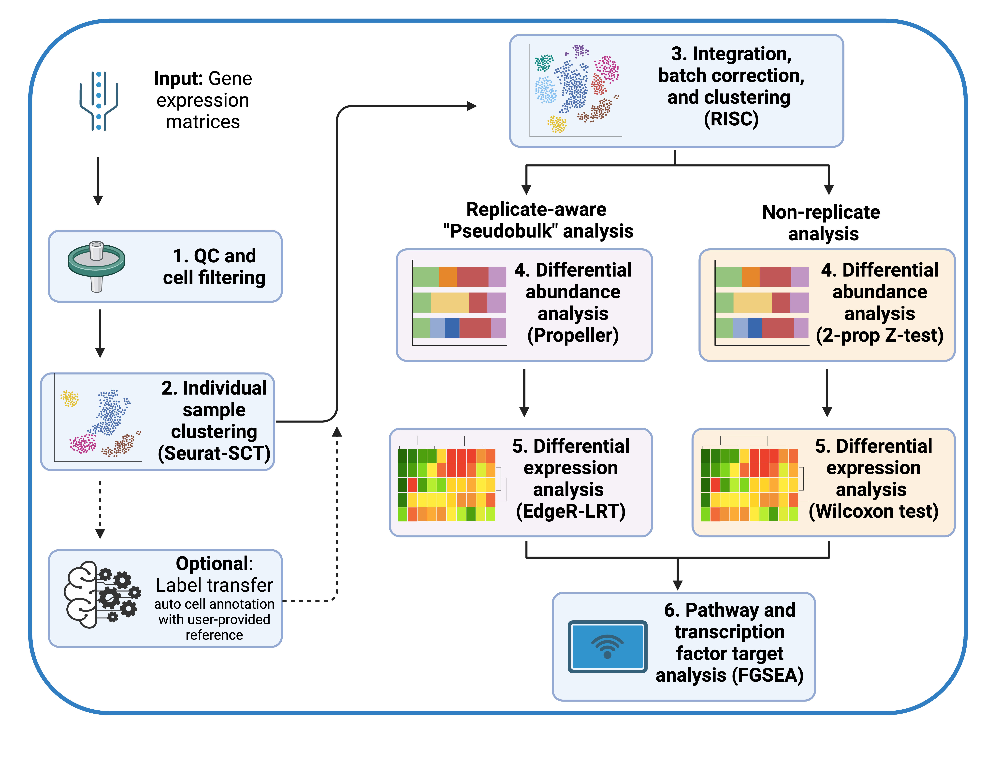

# Single cell Differential Analysis and Processing Pipeline (scDAPP)

This package contains an automated pipeline for scRNA-seq that includes individual and integrated data analysis as well as comparative compositional analysis and DE analysis. **v2.0** supports multiple sample-integration backends via `integration_method` (default `RISC`; Seurat v5 CCA, RPCA, Harmony, and SCT variants also supported). See the [usage instructions](https://github.com/bioinfoDZ/scDAPP/blob/main/Documentation/Usage.md) for integration options and parameters.





<br />


## Installation

This package relies on key dependencies including R >= 4.0, Seurat >= 5.0, and RISC >= 1.7. If you have those working then you should be able to install with minimal difficulty.

For more details including installing on HPC and installing within a Conda environment, see the [detailed installation instructions](https://github.com/bioinfoDZ/scDAPP/blob/main/Documentation/Installation.md).

You can install this package and its dependencies from Github with:

``` r
# install.packages("devtools")
devtools::install_github("bioinfoDZ/scDAPP")
```

If you run into any issues, you can check the [common bugs and fixes FAQ](https://github.com/bioinfoDZ/scDAPP/blob/main/Documentation/CommonBugs.md). If the error is not reported there, please save the error message and open a Github Issue in this repository.


<br />
<br />


## scRNA-seq pipeline quickstart usage

For detailed input and usage instructions, please see the [usage instructions](https://github.com/bioinfoDZ/scDAPP/blob/main/Documentation/Usage.md).


Minimally, this pipeline needs three inputs: the raw UMI counts data in .h5 files or Seurat objects, a file called `sample_metadata.csv` that contains info about the samples, and a file called `comps.csv` that tells the pipeline which cross-condition comparison to perform.


<br />

#### 1. Prepare inputs


##### Make a file called pipeline_runner.R containing the following:

```
# test packages (attach_scDAPP_pipeline_libraries + version table)
scDAPP::r_package_test()

# run pipeline with options
scDAPP::scRNAseq_pipeline_runner(
               datadir = 'path/to/cellranger/outputs',
               outdir = 'path/to/output/folder',
               sample_metadata = 'path/to/sample_metadata.csv',
               comps = 'path/to/comps.csv',
               Pseudobulk_mode = T, #set to F if no replicates

               use_labeltransfer = F,
               refdatapath = 'path/to/reference/Seuratobject_SCTnormalized.rds',
               m_reference = 'path/to/reference/reference_FindAllMarkers.rds',

               species = 'Mus musculus',

               # integration_method = 'RISC',  # or CCAIntegration, HarmonyIntegration, etc.
               # run_msigdb_celltype_ora = TRUE,  # requires clusterProfiler (default TRUE)

               workernum = 1,
               input_seurat_obj = F
               )

```


##### Input 1: Prep the input gene expression data samples
The main input is raw counts, either in the form of .h5 files or Seurat objects.

If you want to input .h5 files (ie from Cellranger), datadir should have sub-folders, one per sample. The subfolder names should match the "Sample" column in `sample_metadata.csv`. Minimally, each sub-folder should contain a file called "filtered_feature_bc_matrix.h5" somewhere in the sub-folder, the pipeline will search for it.

Or, if you want to input Seurat objects, datadir should be a folder with Seurat objects saved as .RDS files, one per sample. The names should match the pseudobulk metadata Sample column, ie "SampleXYZ1.rds", "SampleXYZ2.rds". Then you can set `input_seurat_obj` to TRUE. Note that this option provides flexibility and can be used to process pre-filtered samples, hashed/demultiplexed samples, published data not in h5 format, etc- as long as you can get it into a Seurat object. Also, note that this pipeline works with raw counts. The Seurat assay should be called "RNA" and the layer/slot should be set to "counts".

##### Input 2: `sample_metadata` - tell the pipeline what your samples are

`sample_metadata.csv` tells the pipeline what the samples are, and which condition (ie genotype or experimental state) they are. It should be a csv file that looks like this:

```
Sample,Condition,Code
SampleXYZ1,Control,Control1
SampleXYZ2,Control,Control2
SampleABC1,KO1,KO1_1
SampleABC2,KO1,KO1_2
SampleJKL1,KO2,KO2_1
SampleJKL2,KO2,KO2_1
```
Minimally, you just need Sample and Condition. Sample should match the folders containing h5 files (ie, cellranger output folders), or Seurat objects if `input_seurat_obj` is set to TRUE (ie SampleXYZ1.rds). The Code column is optional and allows you to give nicknames to the samples.

##### Input 3: comps - tell the pipeline what comparisons to perform

`comps.csv` will tell the pipeline which cross-condition comparison(s) to perform, and it should be a file like this:

```
c0,c1
Control,KO1
Control,KO2
KO1,KO2
```

Optional columns: `formula` (e.g. `~ Condition + Batch`), `contrast`, `label`. Legacy `c1,c2` CSVs still work (`c2` is renamed to `c0`).

<br />

### 2. Execute pipeline_runner.R from unix shell command line

The pipeline will take a fair amount of time and memory. A run with 11 samples took around 24 hours and ran successfully with an allocation of 150GB of memory. It is recommended to use a powerful computer or server such as an HPC system.

Below is an example SLURM HPC submission script. Note fields you may want to edit related to cores, time and memory requests of the job. See the [usage instructions](https://github.com/bioinfoDZ/scDAPP/blob/main/Documentation/Usage.md) for resource requirement estimation for cores, memory, and time.
- `cpus-per-task`: number of cores for parallelization. Set this equal to `workernum` in the pipeline_runner.R file.
- `t`: the time you are requesting for the job.
- `mem`: how much RAM the job should be given.
- `p`: the name of the SLURM partition you are submitting to. This will vary based on your HPC - see your HPC's guides or ask the admins for advice for how to pick this, based on the requested resources above.

```
#!/bin/bash
#SBATCH -p normal
#SBATCH --job-name=scDAPP
#SBATCH -N 1
#SBATCH --tasks-per-node=1
#SBATCH --cpus-per-task=1
#SBATCH --mem=100gb
#SBATCH -t 48:00:00
#SBATCH -o /path/to/job/report/%x-%A_%a.out


#my conda
# you may need to install your own local conda on HPC
# https://docs.conda.io/en/latest/miniconda.html
source /gs/gsfs0/home/aferrena/packages/miniconda3/miniconda3/etc/profile.d/conda.sh

#activate conda env
# see detailed install instructions for this conda env
conda activate 2025scdapp

#run R file 
# assumes there is the file "pipeline_runner.R" in the current working directory
rfile=pipeline_runner.R

echo Submitting $rfile

R CMD BATCH --no-save --no-restore $rfile

conda deactivate


printf '\n\n\nAll Done!!!\n\n\n'


echo $SLURM_JOB_NAME
echo $SLURM_JOB_ID
```

If you put the script above in a file called submit_scDAPP.sh, you can run it via: `sbatch submit_scDAPP.sh`

Note that this will create a file with extension ".Rout" with a log of the pipeline. The normal sbatch output log files will probably be empty. This is due to the way `R CMD BATCH` works.


Alternatively, if your computer has high memory and can keep running for hours, you can execute from the Unix command line (bash, zsh) like so:

```
nohup R CMD BATCH --no-save --no-restore pipeline_runner.R &
```

<br />
<br />

## Upgrading from v1.3

If you used scDAPP v1.3.x, note these **v2.0** breaking changes (full detail in [Usage — Upgrading from v1.3](Documentation/Usage.md#upgrading-from-v13) and the [Changelog](Documentation/Changelog.md)):

- **`comps.csv`:** use `c0` (reference) and `c1` (test); legacy `c2` is auto-renamed to `c0`.
- **Integrated assay:** batch-corrected RISC expression is stored in Seurat assay **`Integrated_RISC`** (formerly `"RISC"`).
- **MSigDB cache:** prepared pathway tables are cached under the user/R cache, not `multisample_integration/pathwayanalysis_crosscondition/msigdb_pathways.rds`.
- **`cluster_unfiltered`:** default is `FALSE`; the `unfiltered_Seurat_objects/` folder and unfiltered Seurat RDS files are created only when set to `TRUE`.
- **Module return types:** cross-condition modules return flat tables; see the Changelog if you call modules programmatically (the subclustering vignette is not yet fully updated).

<br />

## Outputs and downstream

A diagram showing the output files is shown below (the figure may not yet show all v2 folders such as `celltype_marker_prediction/`):


The .HTML file contains a report summarizing all steps and results of the analysis. The folders contain information including plots, marker .csv files (which can be opened with Excel), and Seurat / RISC objects which can be used for downstream analysis.

Assays and layers in the integrated Seurat object at `multisample_integration/data_objects/Seurat-object_integrated.rds` depend on `integration_method`:

**All methods**
- **RNA** assay: `counts` = concatenated raw UMI counts from all samples (used for pseudobulk DE). `data` = log-normalized values from `NormalizeData()`.
- **predictions** assay (optional): [label transfer](https://satijalab.org/seurat/articles/integration_mapping) scores when `use_labeltransfer = TRUE`.

**`integration_method = "RISC"`**
- **Integrated_RISC** assay: `data` = batch-corrected log-normalized matrix from RISC; `counts` ≈ `expm1(data)`. Primary assay for plotting and Wilcox DE.
- **RISC-object_integrated.rds** in the same folder holds the native RISC object.

**Seurat integration methods** (`CCAIntegration`, `RPCAIntegration`, `HarmonyIntegration`, `*_SCT`)
- Batch correction lives in **reductions** (not a merged expression assay). See [Usage — Integration assays and reductions](Documentation/Usage.md#integration-assays-and-reductions).

**New v2 output folders**
- `celltype_marker_prediction/` under individual and integrated analysis (MSigDB cell-type ORA; on by default).
- `integrated_analysis/cluster_stability/` when `pcs_int` or `res_int` is `"auto"`.


For downstream analysis tips including using aPEAR for network enrichment analysis, ShinyCell for making an exploratory analysis app, or strategies to re-run the DE analysis after calling celltypes or sub-clustering, see the [downstream instructions guide](https://github.com/bioinfoDZ/scDAPP/tree/main/Documentation/downstream_postpipeline).


<br />
<br />


## Example Dataset

Please see [here](https://github.com/FerrenaAlexander/scDAPP_example_data) for an example dataset.

<br />

## Common errors and fixes

Please see [here](https://github.com/bioinfoDZ/scDAPP/blob/main/Documentation/CommonBugs.md).

<br />

## Changelog

Please see [here](https://github.com/bioinfoDZ/scDAPP/blob/main/Documentation/Changelog.md).

<br />

## Citing scDAPP

Please cite our publication: [scDAPP: a comprehensive single-cell transcriptomics analysis pipeline optimized for cross-group comparison, NAR Genomics and Bioinformatics 2024](https://academic.oup.com/nargab/article/6/4/lqae134/7786160)


