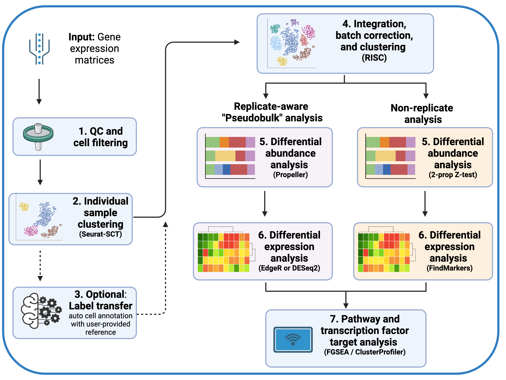

# Single cell Differential Analysis and Processing Pipeline (scDAPP)

This package contains an automated pipeline for scRNA-seq that includes individual and integrated data analysis as well as comparative compositional analysis and DE analysis.





## Citing scDAPP

Please cite our publication: [scDAPP: a comprehensive single-cell transcriptomics analysis pipeline optimized for cross-group comparison, NAR Genomics and Bioinformatics 2024](https://academic.oup.com/nargab/article/6/4/lqae134/7786160)


<br />
<br />


## Installation

This package relies on key dependencies including R >= 4.0, Seurat >= 5.0, and RISC >= 1.7. If you have those working then you should be able to install with minimal difficulty.

For more details including installing on HPC and installing within a conda environment, see the [detailed installation instructions](https://github.com/bioinfoDZ/scDAPP/blob/main/Documentation/Installation.md).

1. First **install Matrix and irlba** from source. Installing irlba from source after Matrix will prevent [this common error](https://github.com/bioinfoDZ/scDAPP/blob/main/Documentation/CommonBugs.md#1-function-as_cholmod_sparse-not-provided-by-package-matrix).
```
install.packages("Matrix", type = "source")
install.packages("irlba", type = "source")
```

2. You can then install this package and its dependencies from Github with:

``` r
# install.packages("devtools")
devtools::install_github("bioinfoDZ/scDAPP")
```


<br />
<br />


## scRNA-seq pipeline quickstart usage

For detailed input and usage instructions, please see the [usage instructions](https://github.com/bioinfoDZ/scDAPP/blob/main/Documentation/Usage.md).


Minimally, this pipeline needs three inputs: the raw UMI counts data in .h5 files or Seurat objects, a file called `sample_metadata.csv` that contains info about the samples, and a file called `comps.csv` that tells the pipeline which cross-condition comparison to perform.


<br />

#### 1. Prepare inputs


##### Make a file called pipeline_runner.R containing the following:

```
#test packages
scDAPP::r_package_test()

#run pipeline with options
scDAPP::scRNAseq_pipeline_runner(
               datadir = 'path/to/cellranger/outputs',
               outdir = 'path/to/output/folder',
               sample_metadata = 'path/to/sample_metadata.csv'
               comps = 'path/to/comps.csv',
               Pseudobulk_mode = T, #set to F if no replicates

               use_labeltransfer = F,
               refdatapath = 'path/to/reference/Seuratobject_SCTnormalized.rds',
               m_reference = 'path/to/reference/reference_FindAllMarkers.rds',

               species = 'Mus musculus',

               workernum = 1,
               input_seurat_obj = F
               )

```


##### Input 1: Prep the input gene expression data samples
The main input is raw counts, either in the form of .h5 files or Seurat objects.

If you want to input .h5 files (ie from Cellranger), datadir should have sub-folders, one per sample. They should match the "Sample" column in `sample_metadata.csv`. Minimally, each sub-folder should contain a file called "filtered_feature_bc_matrix.h5" somewhere in the sub-folder, the pipeline will search for it.

Or, if you want to input Seurat objects, datadir should be a folder with Seurat objects saved as .RDS files, one per sample. The names should match the pseudobulk metadata Sample column, ie "SampleXYZ1.rds", "SampleXYZ2.rds". Then you can set `input_seurat_obj` to TRUE. Note that this option provides flexibility and can be used to process pre-filtered samples, hashed/demultiplexed samples, published data not in h5 format, etc- as long as you can get it into a Seurat object. Also, note that assay should be called "RNA" and the layer should be set to "counts".

##### Input 2: `sample_metadata` - tell the pipeline what your samples are

`sample_metadata.csv` tells the pipeline what the samples are, and which condition (genotype or experimental state) they are. It should be a csv file that looks like this:

```
Sample,Condition,Code
SampleXYZ1,Control,Control1
SampleXYZ2,Control,Control2
SampleABC1,KO1,KO1_1
SampleABC2,KO1,KO1_2
SampleJKL1,KO2,KO2_1
SampleJKL2,KO2,KO2_1
```
Minimally, you just need Sample and Condition. Sample should match the folders containing h5 files (ie, cellranger output folders), or Seurat objects if `input_seurat_obj` is set to TRUE (ie SampleXYZ1.rds). The Code column is optional and allows you to give nicknames to the samples.

##### Input 3: comps - tell the pipeline what comparisons to perform

`comps.csv` will tell the pipeline which cross-condition comparison(s) to perform, and it should be a file like this:

```
c1,c2
KO1,Control
KO2,Control
KO1,KO2
```

<br />

### 2. Execute pipeline_runner.R from unix shell command line

The pipeline will take a fair amount of time and memory. A run with 11 samples took around 24 hours and ran successfully with an allocation of 150GB of memory.


You can submit a Slurm HPC job to run it. One example might look something like below.

```
#!/bin/bash
#SBATCH -p normal
#SBATCH --job-name=scDAPP
#SBATCH -N 1
#SBATCH --tasks-per-node=1
#SBATCH --cpus-per-task=1
#SBATCH --mem=100gb
#SBATCH -t 48:00:00
#SBATCH -o /path/to/job/report/%x-%A_%a.out


#my conda
# you may need to install your own local conda on HPC
# https://docs.conda.io/en/latest/miniconda.html
source /gs/gsfs0/home/aferrena/packages/miniconda3/miniconda3/etc/profile.d/conda.sh

#activate r_env
# see detailed install instructions for this conda env
conda activate r_env

#run R file 
# assumes there is the file "pipeline_runner.sh" in the current working directory
rfile=pipeline_runner.R

echo Submitting $rfile

R CMD BATCH --no-save --no-restore $rfile

conda deactivate


printf '\n\n\nAll Done!!!\n\n\n'


echo $SLURM_JOB_NAME
echo $SLURM_JOB_ID
```

If you put the script above in a file called submit_scDAPP.sh, you can run it via: `sbatch submit_scDAPP.sh`

Note that this will create a file with extension ".Rout" with a log of the pipeline. The normal sbatch output log files will probably be empty. This is due to the way `R CMD BATCH` works.


Alternatively, if your computer has high memory and can keep running for hours, you can execute from the Unix command line (bash, zsh) like so:

```
nohup R CMD BATCH --no-save --no-restore pipeline_runner.R &
```

<br />
<br />

## Outputs and downstream

The outputs are shown below:


The .HTML file contains a report summarizing all steps and results of the analysis. The folders contain information including plots, marker .csv files (which can be opened with Excel), and Seurat / RISC objects which can be used for downstream analysis.

Assays and layers / slots of the integrated Seurat object found at `multisample_integration/data_objects/Seurat-object_integrated.rds` are as follows:
- RISC assay: "data" layer contains batch-corrected matrix direct and unmodified from RISC, which is in natural log space (log1p). "counts" layer contains antilog to "count" space, "batch corrected counts". Data layer is most useful.
- RNA assay: "counts" layer contains a concatenated matrix of raw UMI counts (non-normalized, non-batch corrected) from all samples. "data" layer contains something similar to Log1p counts (the output of `Seurat::NormalizeData()`).
- Predictions assay: [label transfer](https://satijalab.org/seurat/articles/integration_mapping) scores from Seurat.


For downstream analysis tips including using aPEAR for network enrichment analysis, ShinyCell for making an exploratory analysis app, or strategies to re-run the DE analysis after calling celltypes or sub-clustering, see the [downstream instructions guide](https://github.com/bioinfoDZ/scDAPP/tree/main/Documentation/downstream_postpipeline).


<br />
<br />


## Example Dataset

Please see [here](https://github.com/FerrenaAlexander/scDAPP_example_data) for an example dataset.

<br />

## Common errors and fixes

Please see [here](https://github.com/bioinfoDZ/scDAPP/blob/main/Documentation/CommonBugs.md).

<br />

## Changelog

Please see [here](https://github.com/bioinfoDZ/scDAPP/blob/main/Documentation/Changelog.md).


